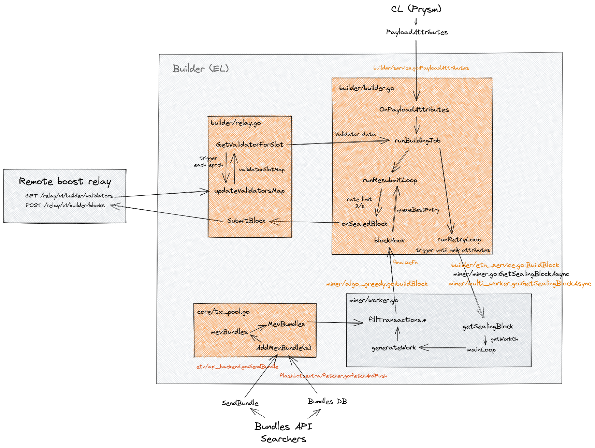

[geth readme](README.original.md)

# Flashbots Block Builder

This project implements the Flashbots block builder, based on go-ethereum (geth).

See also: https://docs.flashbots.net/flashbots-mev-boost/block-builders

Run on your favorite network, including Mainnet, Goerli, Sepolia and local devnet. Instructions for running a pos local devnet can be found [here](https://github.com/avalonche/eth-pos-devnet).

You will need to run a modified beacon node that sends a custom rpc call to trigger block building. You can use the modified [prysm fork](https://github.com/flashbots/prysm) for this.

Test with [mev-boost](https://github.com/flashbots/mev-boost) and [mev-boost test cli](https://github.com/flashbots/mev-boost/tree/main/cmd/test-cli).

Building `geth` requires both a Go (version 1.19 or later) and a C compiler. You can install
them using your favourite package manager. Once the dependencies are installed, run

## How it works

* Builder polls relay for the proposer registrations for the next epoch when block building is triggered
* If both local relay and remote relay are enabled, local relay will overwrite remote relay data. This is only meant for the testnets!

## Limitations

* Does not accept external blocks
* Does not have payload cache, only the latest block is available

# Usage

Configure geth for your network, it will become the block builder.

Builder-related options:
```
$ geth --help

   BUILDER

    --builder                      (default: false)
          Enable the builder

    --builder.algotype value       (default: "mev-geth")
          Block building algorithm to use [=mev-geth] (mev-geth, greedy, greedy-buckets)
   
    --builder.beacon_endpoints value (default: "http://127.0.0.1:5052")
          Comma separated list of beacon endpoints to connect to for beacon chain data
          [$BUILDER_BEACON_ENDPOINTS]

    --builder.bellatrix_fork_version value (default: "0x02000000")
          Bellatrix fork version. [$BUILDER_BELLATRIX_FORK_VERSION]

    --builder.blacklist value     
          Path to file containing blacklisted addresses, json-encoded list of strings.
          Builder will ignore transactions that touch mentioned addresses.
   
    --builder.block_resubmit_interval value (default: "500ms")
          Determines the interval at which builder will resubmit block submissions
          [$FLASHBOTS_BUILDER_RATE_LIMIT_RESUBMIT_INTERVAL]

    --builder.cancellations        (default: false)
          Enable cancellations for the builder

    --builder.discard_revertible_tx_on_error (default: false)
          When enabled, if a transaction submitted as part of a bundle in a send bundle
          request has error on commit, and its hash is specified as one that can revert in
          the request body, the builder will discard the hash of the failed transaction
          from the submitted bundle.For additional details on the structure of the request
          body, see
          https://docs.flashbots.net/flashbots-mev-share/searchers/understanding-bundles#bundle-definition
          [$FLASHBOTS_BUILDER_DISCARD_REVERTIBLE_TX_ON_ERROR]

    --builder.dry-run              (default: false)
          Builder only validates blocks without submission to the relay

    --builder.genesis_fork_version value (default: "0x00000000")
          Gensis fork version. [$BUILDER_GENESIS_FORK_VERSION]

    --builder.genesis_validators_root value (default: "0x0000000000000000000000000000000000000000000000000000000000000000")
          Genesis validators root of the network. [$BUILDER_GENESIS_VALIDATORS_ROOT]

    --builder.ignore_late_payload_attributes (default: false)
          Builder will ignore all but the first payload attributes. Use if your CL sends
          non-canonical head updates.

    --builder.listen_addr value    (default: ":28545")
          Listening address for builder endpoint [$BUILDER_LISTEN_ADDR]

    --builder.local_relay          (default: false)
          Enable the local relay

    --builder.no_bundle_fetcher    (default: false)
          Disable the bundle fetcher

    --builder.price_cutoff_percent value (default: 50)
          flashbots - The minimum effective gas price threshold used for bucketing
          transactions by price. For example if the top transaction in a list has an
          effective gas price of 1000 wei and price_cutoff_percent is 10 (i.e. 10%), then
          the minimum effective gas price included in the same bucket as the top
          transaction is (1000 * 10%) = 100 wei.
          NOTE: This flag is only used when
          builder.algotype=greedy-buckets [$FLASHBOTS_BUILDER_PRICE_CUTOFF_PERCENT]

    --builder.rate_limit_duration value (default: "500ms")
          Determines rate limit of events processed by builder. For example, a value of
          "500ms" denotes that the builder processes events every 500ms. A duration string
          is a possibly signed sequence of decimal numbers, each with optional fraction
          and a unit suffix, such as "300ms", "-1.5h" or "2h45m"
          [$FLASHBOTS_BUILDER_RATE_LIMIT_DURATION]

    --builder.rate_limit_max_burst value (default: 10)
          Determines the maximum number of burst events the builder can accommodate at any
          given point in time. [$FLASHBOTS_BUILDER_RATE_LIMIT_MAX_BURST]

    --builder.relay_secret_key value (default: "0x2fc12ae741f29701f8e30f5de6350766c020cb80768a0ff01e6838ffd2431e11")
          Builder local relay API key used for signing headers [$BUILDER_RELAY_SECRET_KEY]

    --builder.remote_relay_endpoint value
          Relay endpoint to connect to for validator registration data, if not provided
          will expose validator registration locally [$BUILDER_REMOTE_RELAY_ENDPOINT]

    --builder.secondary_remote_relay_endpoints value
          Comma separated relay endpoints to connect to for validator registration data
          missing from the primary remote relay, and to push blocks for registrations
          missing from or matching the primary [$BUILDER_SECONDARY_REMOTE_RELAY_ENDPOINTS]

    --builder.seconds_in_slot value (default: 12)
          Set the number of seconds in a slot in the local relay

    --builder.secret_key value     (default: "0x2fc12ae741f29701f8e30f5de6350766c020cb80768a0ff01e6838ffd2431e11")
          Builder key used for signing blocks [$BUILDER_SECRET_KEY]

    --builder.slots_in_epoch value (default: 32)
          Set the number of slots in an epoch in the local relay

    --builder.submission_offset value (default: 3s)
          Determines the offset from the end of slot time that the builder will submit
          blocks. For example, if a slot is 12 seconds long, and the offset is 2 seconds,
          the builder will submit blocks at 10 seconds into the slot.
          [$FLASHBOTS_BUILDER_SUBMISSION_OFFSET]

    --builder.validation_blacklist value
          Path to file containing blacklisted addresses, json-encoded list of strings
          
    --builder.validation_use_balance_diff (default: false)
          Block validation API will use fee recipient balance difference for profit
          calculation.
   
    --builder.validator_checks     (default: false)
          Enable the validator checks

    MINER

    --miner.algotype value         (default: "mev-geth")
          [NOTE: Deprecated, please use builder.algotype instead] Block building algorithm
          to use [=mev-geth] (mev-geth, greedy, greedy-buckets)

    --miner.blocklist value       
          [NOTE: Deprecated, please use builder.blacklist] flashbots - Path to JSON file with
          list of blocked addresses. Miner will ignore txs that touch mentioned addresses.

    --miner.extradata value
          Block extra data set by the miner (default = client version)

    --miner.price_cutoff_percent value (default: 50)
          flashbots - The minimum effective gas price threshold used for bucketing
          transactions by price. For example if the top transaction in a list has an
          effective gas price of 1000 wei and price_cutoff_percent is 10 (i.e. 10%), then
          the minimum effective gas price included in the same bucket as the top
          transaction is (1000 * 10%) = 100 wei.
          NOTE: This flag is only used when
          miner.algotype=greedy-buckets

   METRICS

   --metrics.builder value          (default: false)
            Enable builder metrics collection and reporting
```

Environment variables:
```
BUILDER_TX_SIGNING_KEY - private key of the builder used to sign payment transaction, must be the same as the coinbase address

FLASHBOTS_BUILDER_RATE_LIMIT_DURATION - determines rate limit of events processed by builder; a duration string is a 
possibly signed sequence of decimal numbers, each with optional fraction and a unit suffix, such as "300ms", "-1.5h" or "2h45m".

FLASHBOTS_BUILDER_RATE_LIMIT_MAX_BURST - determines the maximum number of events the builder can accommodate at any point in time

FLASHBOTS_BUILDER_RATE_LIMIT_RESUBMIT_INTERVAL - determines the interval at which builder will resubmit block submissions
```

## Metrics

To enable metrics on the builder you will need to enable metrics with the flags `--metrics --metrics.addr 127.0.0.1 --metrics.builder` which will run
a metrics server serving at `127.0.0.1:6060/debug/metrics`. This will record performance metrics such as block profit and block building times.
The full list of metrics can be found in `miner/metrics.go`.

See the [metrics docs](https://geth.ethereum.org/docs/monitoring/metrics) for geth for more documentation.

## Blacklisting addresses

If you want to reject transactions interacting with certain addresses, save the addresses in json file with an array of strings. Deciding whether to use such a list, as well as maintaining it, is your own responsibility.

- for block building and validation, use `--builder.blacklist`

--

## Details of the implementation

There are two parts of the builder.

1. `./builder` responsible for communicating with the relay
2. `./miner` responsible for producing blocks

### `builder` module

Main logic of the builder is in the `builder.go` file.

Builder is driven by the consensus client SSE events that sends payload attribute events, triggering the `OnPayloadAttribute` call.
After requesting additional validator data from the relay builder starts building job with `runBuildingJob`.
Building job continuously makes a request to the `miner` with the correct parameters and submits produced block.

* Builder retries build block requests every second on average.
* If the job is running but a new one is submitted for a different slot we cancel previous job.
* All jobs have 12s deadline.
* If new request is submitted for the same slot as before but with different parameters, we run these jobs in parallel.
  It is possible to receive multiple requests from CL for the same slot but for different parent blocks if there is a possibility
  of a missed block.
* All submissions to the relay are rate limited at 2 req/s
* Only blocks that have more profit than the previous best submissions for the particular job are submitted.

Additional features of the builder:
* Builder can submit data about build blocks to the database. It stores block data, included bundles, and all considered bundles.
  Implemented in `flashbotsextra.IDatabaseService`.
* It's possible to run local relay in the same process
* It can validate blocks instead of submitting them to the relay. (see `--builder.dry-run`)

### `miner` module

Miner is responsible for block creation. Request from the `builder` is routed to the `worker.go` where
`generateWork` does the job of creating a block.

* Coinbase of the block is set to the address of the block proposer, fee recipient of the validator receives its eth
  in the last tx in the block.
* We reserve gas for the proposer payment using `proposerTxPrepare` and commit proposer payment after txs are added with
  `proposerTxCommit`. We do it in a way so all fees received by the block builder are sent to the fee recipient.
* Transaction insertion is done in `fillTransactionsAlgoWorker` \ `fillTransactions`. Depending on the algorithm selected.
  Algo worker (greedy) inserts bundles whenever they belong in the block by effective gas price but default method inserts bundles on top of the block.
  (see `--miner.algotype`)
* Worker is also responsible for simulating bundles. Bundles are simulated in parallel and results are cached for the particular parent block.
* `algo_greedy.go` implements logic of the block building. Bundles and transactions are sorted in the order of effective gas price then
  we try to insert everything into to block until gas limit is reached. Failing bundles are reverted during the insertion but txs are not.
* Builder can filter transactions touching a particular set of addresses.
  If a bundle or transaction touches one of the addresses it is skipped. (see `--builder.blacklist` flag)

## Bundle Movement

There are two ways bundles are moved to builders

1. via API -`sendBundle`
2. via Database - `flashbotsextra.IDatabaseService`

### `fetcher` service
* Fetcher service is part of `flashbotsextra.IDatabaseService` which is responsible for fetching the bundles from db and pushing into mev bundles queue which will be processed by builder.
* Fetcher is a background process which fetches high priority and low priority bundles from db.
* Fetcher fetches `500` high priority bundles on every head change, and `100` low priority bundles in the interval of every `2 seconds`.

## Block builder diagram



---

# Security

If you find a security vulnerability in this project or any other initiative
related to proposer/builder separation in Ethereum, please let us know sending
an email to security@flashbots.net.

---

# License

The code in this project is free software under the [LGPL License](COPYING.LESSER).

