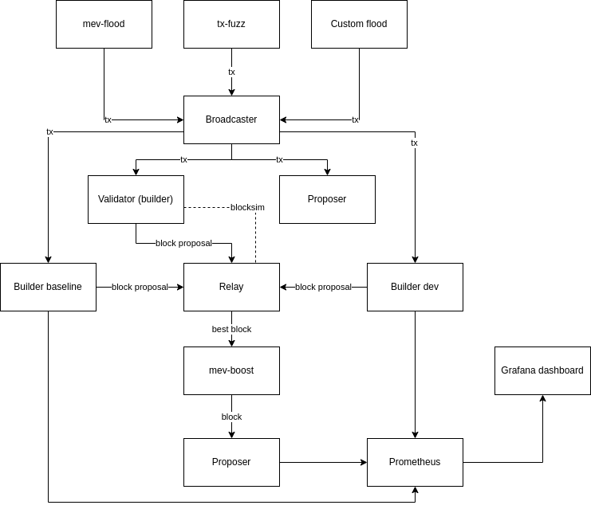

# Emulate Network script

This README accompanies the `emulate_network.go` Go script, which uses Docker, Kurtosis, and the Kurtosis Ethereum-Package enclave to test builder performance.

## Introduction

This script streamlines and automates the process of (re-)building the current builder Docker image and interfacing with the Kurtosis platform. It offers a set of commands to assist developers in routine tasks, such as (re-)building Docker images and managing Kurtosis enclaves.


## Running in dev environment

### Prerequisites

Before using the script, ensure you have the following installed:

1. **Go**: Ensure you have Go installed. Download and install it from [here](https://golang.org/dl/).

2. **Docker**: The build process needs Docker. Make sure Docker is installed and running. Check out the [Docker website](https://www.docker.com/get-started) for installation instructions.

3. **Kurtosis**: The script interfaces with the Kurtosis platform. Ensure `kurtosis` is installed and available in your PATH. Refer to [Kurtosis's official documentation](https://docs.kurtosis.com/install) for installation details.

4. **ethereum-package**: This script utilizes a modified ethereum-package network configuration, which will be downloaded from [repo](github.com/kurtosis-tech/ethereum-package/) main brunch automatically.

### How to Run

To execute the script with Go, navigate to the directory containing the script and run:

```
go run emulate_network.go <COMMAND_NAME> [OPTIONS]
```

Replace `<COMMAND_NAME>` with one of the available commands and provide the necessary options.

### Commands and Options
To run script `cd` into this (`./scripts`) folder.

1. **build**:
   - Purpose: Builds a Docker image of the builder.
   - Options:
      - `-t`:          (Optional) Image tag for the Docker build. Defaults to `flashbots/builder:dev`.
      - `-d`           (Optional) Image Build directory. Defaults to `".."`
      - `-f`           (Optional) Build dockerfile path. Defaults to `"../Dockerfile"`. Use `"./Dockerfile.debug"` for debug capabilities.
      
   - Example:
      ```
	  go run emulate_network.go build -t=test-builder -f="../Dockerfile" -d=".."
      ```


2. **run**:
   - Purpose: Prepares configurations and starts a Kurtosis enclave.
   - Options:
      - `-t`:           (Optional) Image tag. Defaults to `flashbots/builder:dev`.
      - `-n`:           (Optional) Enclave name. Defaults to `explorer`.
      - `-a`:           (Optional) Additional builder arguments.
      - `-s`:           (Optional) Max steps (integer). Defaults to `1000`. Set for `-1` for "unlimited".
      - `-k`:           (Optional) Path to `kurtosis` executable. Defaults to `kurtosis`.
      - `--slotTime`:   (Optional) Seconds per slot applied on local devnet. Defaults to 5.
   - Example:
     ```
     go run emulate_network.go run -t=imageTag -a=imageArgs -n=enclaveName -k=/path/to/kurtosis
     ```

3. **stop**:
   - Purpose: Stops an active Kurtosis enclave.
   - Options:
      - `-k`:           (Optional) Path to `kurtosis` executable. Defaults to `kurtosis`.
      - `-n`:           (Required) Enclave name.
   - Example:
     ```
     go run emulate_network.go stop -k=/path/to/kurtosis -n=enclaveName
     ```

4. **help**:
   - Purpose: Display a summary of available commands and their options.
   - Example:
     ```
     go run emulate_network.go help
     ```
## Dashboard
Grafana dashboard contains three sections: quality comparison, usage of system resources and a section to inspect network behaviour. Each section contain graphs designed to show different properties of the network.

Quality comparison allows to compare builder implementations by analysing bids produced by each of them. It contains four graphs:
* Bids profit - Profit of bids generated by each builder in time. The most important metric to compare effectiveness of builders. 
* Bids creation time - Measures the time spent on creating a single bid. The metric allows to compare performance of builders.
* Bids Txnum - Number of bids submitted per second
* Bids Gas used - Summarized gas of all produced bids per second

The dashboard also provides graphs showing usage of system resources: CPU, memory, disk and network. It allows to monitor resources and quickly identify regressions in resource utilization of a particular implementation.

Network inspection gives an overview of the network. It provides information such as the transaction pool, block processing time, transaction propagation and database access. The section may be useful in certain circumstances to get the detailed information and for debugging. 

## Architecture


The architecture consists of fuzzer layer, broadcaster, network, MEV services and data collection layer.

Fuzzer layer:
* [mev-flood](https://github.com/flashbots/mev-flood) - Spams the network with uniswap swaps 
* (tx-fuzz)[https://github.com/MariusVanDerWijden/tx-fuzz/tree/master] - generates random transactions and deploys by utilizing (FuzzyVM)[https://github.com/MariusVanDerWijden/FuzzyVM]
* [Custom flood(https://github.com/kurtosis-tech/ethereum-package/blob/c558cb2eab25cc8c3718b1fda6759a0819e6f942/src/mev_custom_flood/sender.py)] - Simple fuzzer sending tokens between two accounts

Fuzzer layer sends transactions to the broadcaster which replicate those and broadcast them to all nodes in parallel.

Test network consists of 4 nodes:
* Dev builder - candidate to be merged.
* Baseline builder - current version of builder.
* Validator builder - connected to the relay as validator. Being relay validator affects performance of the builder therefore the third builder is used to keep the competition between dev and baseline fair.
* Proposer - regular execution layer client. The node contains validators that propose and vote for new blocks. It also builds blocks in epochs 0-3.

Among those nodes there are three builders that send their bids to the relay. Then the best bid is chosen and passed to the proposer node which proposes it as the new block.

Data collection layer consists of prometheus and grafana. Prometheus gathers the data from all nodes, while grafana displays the data for chosen nodes in form of graphs.

## Known issues
### Kurtosis errors on network start
In case of system resource related errors or on windows docker restore after sleep Kurtosis may have trouble starting a new enclave. 
1. Make sure you have no valuable containers up and running in enclaves or docker
2. To clean up Kurtosis call `kurtosis clean -a`
3. To clean up docker run `docker rm -vf $(docker ps -aq)`


## Running in Docker in Docker (WIP)
See [README](./dind#readme).
